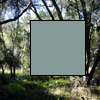

#### Nome
### get()

#### Exemplos


```pde
PImage myImage = loadImage("topanga.jpg"); 
image(myImage, 0, 0); 
PImage cp = get(); 
image(cp, 50, 0); 
 

```


```pde
PImage myImage = loadImage("topanga.jpg"); 
image(myImage, 0, 0); 
color cp = get(30, 20); 
fill(cp); 
rect(30, 20, 55, 55); 

```

#### Descrição
Lê a cor de qualquer píxel ou pega a
seção de uma imagem. Se nenhum parâmetro é
especificado, a imagem inteira é retornada.  Pega-se o
valor de um píxel ao especificar as coordenadas x e y. Pega-se a
seção de uma imagem ao especificar parâmetros
adicionais de `largura` e ` altura`.
Se o píxel requerido estiver fora da janela da imagem, preto
é retornado. Os números retornados são escalados
de acordo com as escalas de cor atuais, mas apenas valores RGB
são retornados por esta função. Por exemplo,
embora se possa desenhar uma forma em `coloMode(HSB)`, os números retornados serão em RGB.


A função `imageMode() `modificará o modo de trabalho dos parâmetros. Por exemplo, uma chamada à `imageMode(CORNERS) ` modificará
 os parâmetros de definirem largura e altura para definirem
os valores dos cantos opostos a x e y.


Para se pegar a cor de um único píxel com `get(x,y)`
é fácil, mas não é tão rápido
quanto se pegar esta informação diretamente de `pixels[]`. O comando equivalente à "get(x,y)"que faz uso de `pixels[] `é "pixels[y*largura+x]".  A versão BETA de Processing requer que se chame `loadPixels() `para se carregar a janela de visualização no array `pixels[]` antes que se pegue os valores. ow data into the **pixels[]** array before getting the values.

#### Sintaxe
```pde
get()
get(x, y)
get(x, y, largura, altura)

```
Parâmetros
x
int: coordenada-x do píxel

y
int: coordenada-y  do píxel


largura
int: largura do retângo de pixels a pegar


altura
int: altura do retângulo de pixels a pegar


#### Retorno

	
color ou PImage

#### Utilização

	
Web & Applicações

#### Relacionado
[set()](set_
)
[pixels[]](pixels
)

