# Natureza do código - por Daniel Shiffman

## Introdução

*"Eu sou dois com a natureza." - Woody Allen*

<br>

Aqui estamos: o começo. Bem, quase o começo. Se faz algum tempo que você não programa em Processing (ou, ainda, que você não usa um pouco de matemática), esta introdução pretende trazer de volta à sua mente o modo de pensar computacional antes de chegarmos ao material mais difícil e complexo.

No Capítulo 1, vamos falar sobre o conceito de vetor e como este serve como base para construção de simulações de movimento ao longo do livro. Mas antes de darmos este passo, vamos pensar sobre o que significa algo se mover pela tela. Vamos começar com uma das mais conhecidas e simples simulações de movimento — a caminhada aleatória (*random walker*).

### I.1 Caminhada Aleatória

Imagine que você está no meio de uma trave olímpica. A cada dez segundos, você lança uma moeda. Se der cara, você dá um passo para frente. Coroa, um passo para trás. Isso é uma caminhada aleatória — um percurso definido por uma série de passos aleatórios. Descendo da trave de exercícios para o chão, você pode fazer uma caminhada aleatória em duas dimensões lançando a mesma moeda duas vezes seguindo os resultados:

Jogada 1 | Jogada 2 | Resultado
------------ | ------------- | -------------
Cara | Cara | Passo para frente.
Cara | Coroa | Passo para direita.
Coroa | Cara | Passo para esquerda.
Coroa | Coroa | Passo para trás.

Bom, isso pode parecer um algoritmo particularmente simples. No entanto, caminhadas aleatórias podem ser usadas para modelar fenômenos que acontecem no mundo real, de movimentos de moléculas em um gás até o comportamento de um jogador passando o dia em um cassino. Começaremos o livro estudando uma caminhada aleatória com três objetivos em mente.

1. Precisamos rever um conceito de programação central para este livro — programação orientada a objetos. O nosso passeador aleatório, *random walker*, servirá de modelo para como usaremos a programação orientada a objetos para fazer coisas que se movem numa janela do Processing.

2. A caminhada aleatória instiga duas questões que vamos nos perguntar repetidamente neste livro: "Como vamos definir as regras que governam o comportamento dos nossos objetos?" e então, "Como vamos implementar essas regras no Processing?"

3. Ao longo do livro, nós vamos periodicamente precisar de uma compreensão básica da aleatoriedade, probabilidade e ruído Perlin. A caminhada aleatória nos permitirá demonstrar alguns pontos chave que serão úteis mais para frente.

### I.2 A classe Random Walker

Vamos rever um pouco de programação orientada a objetos ("POO") primeiramente construindo um objeto Walker ("Caminhante"). Esta será apenas uma revisão rápida. Se você nunca trabalhou com POO antes, pode ser que queira algo mais completo; Eu sugeriria parar aqui e revisar o básico no site do [Processing](https://processing.org/tutorials/objects/) (página em Inglês) antes de continuar.


Um **objeto** em Processing é uma entidade que possui dados e funcionalidade. Nós queremos projetar um objeto Walker que mantém tanto o registro de seus dados (onde ele existe na tela) quanto tem a capacidade de executar certas ações (como se desenhar ou dar um passo).

Uma **classe** é o modelo para criar instâncias reais de objetos. Pense em uma classe como um cortador de biscoitos; os objetos são os próprios biscoitos.

Vamos começar definindo a classe Walker - o que significa ser um objeto Walker. O Walker só precisa de dados: um número para sua localização x e um para sua localização y.

```java
class Walker {
    int x;		// Objetos possuem informações (dados).
    int y;
```

Cada classe deve ter um construtor, uma função especial que é chamada quando o objeto é criado pela primeira vez. Você pode pensar nisso como o `setup()` - configuração - do objeto. Lá, inicializaremos a localização inicial do Walker (neste caso, o centro da janela).

```java
Walker() {		// Os objetos têm um construtor onde eles são inicializados.
    x = width/2;
    y = height/2;
}
```

Finalmente, além de dados, as classes podem ser definidas com funcionalidades. Neste exemplo, um Walker tem duas funções. Primeiro, escrevemos uma função que permite que o objeto se exiba (como um ponto branco).

```java
void display() {		// Os objetos têm funções.
    stroke(0);
    point(x,y);
}
```

A segunda função direciona o objeto Walker para dar um passo. Agora, é aqui que as coisas ficam um pouco mais interessantes. Se lembra de quando estávamos andando aleatoriamente pelo chão? Bem, agora podemos usar uma janela no Processing para fazer a mesma coisa. Existem quatro passos possíveis. Um passo para a direita pode ser simulado incrementando x (x ++); para a esquerda, decrementando x (x --); para a frente, indo para baixo um pixel (y ++); e para trás, subindo um pixel (y --). Como escolhemos uma dessas quatro possibilidades? Anteriormente, afirmamos que poderíamos virar duas moedas. No Processing, no entanto, quando queremos escolher aleatoriamente de uma lista de opções, podemos escolher um número aleatório usando o `random()`.

```java
void step() {
    int choice = int(random(4));		// 0, 1, 2, ou 3.
```

A linha de código acima escolhe um número de ponto flutuante aleatório (*random floating point number*) entre 0 e 4 e converte-o em um número inteiro, com um resultado de 0, 1, 2 ou 3. Tecnicamente falando, o número mais alto nunca será 4.0, mas sim 3,999999999 (com tantos 9s quanto casas decimais existentes); uma vez que o processo de conversão para um número inteiro sai da casa decimal, o `int` mais alto que podemos obter é 3. Em seguida, tomamos o passo apropriado (esquerda, direita, para cima ou para baixo) dependendo do número aleatório que foi escolhido.

```java
if (choice == 0) {		// A escolha aleatória determina nosso passo.
      x++;
    } else if (choice == 1) {
      x--;
    } else if (choice == 2) {
      y++;
    } else {
      y--;
    }
  }
}
```

Agora que escrevemos a classe, é hora de fazer um objeto Walker na parte principal do nosso *sketch* - `setup()` e `draw()`. Assumindo que estamos procurando modelar uma única caminhada aleatória, declaramos uma variável global do tipo Walker.

```java
Walker w;		// Um objeto Walker.
```
Em seguida, criamos o objeto no `setup()` chamando o construtor com o novo operador.

#### Exemplo I.1: Caminhada aleatória tradicional

*Cada vez que você vê o cabeçalho de Exemplo neste livro, significa que há um exemplo de código correspondente disponível no* [GitHub](https://github.com/shiffman/The-Nature-of-Code-Examples).

```java
void setup() {
  size(640,360);
  w = new Walker();		// Crie o walker.
  background(255);
}
```

Finalmente, durante cada ciclo através do `draw()`, pedimos ao Walker para dar um passo e desenhar um ponto.

```java
void draw() {
  w.step();		// Chame as funções do walker.
  w.display();
}
```

Uma vez que desenhamos o plano de fundo apenas uma vez no `setup()`, em vez de limpá-lo continuamente cada vez através do `draw()`, vemos a trilha da caminhada aleatória em nossa janela do Processing.


Existem algumas melhorias que poderíamos fazer para o caminhante aleatório. Primeiro, as escolhas deste Walker estão limitadas a quatro opções - para cima, para baixo, para a esquerda e para a direita. Mas qualquer pixel da janela tem oito possíveis vizinhos, e uma nona possibilidade é ficar no mesmo lugar.


Para implementar um objeto Walker que pode pisar em qualquer pixel vizinho (ou ficar parado), poderíamos escolher um número entre 0 e 8 (nove escolhas possíveis). No entanto, a maneira mais eficiente para escrever este código seria a de simplesmente escolher a partir de três passos possíveis ao longo do eixo x (-1, 0, ou 1) e três passos possíveis ao longo do eixo y.

```java
 void step() {
    int stepx = int(random(3))-1;		// Fornece -1, 0 ou 1.
    int stepy = int(random(3))-1;
    x += stepx;
    y += stepy;
  }
```

Indo além, poderíamos usar números de ponto flutuante (ou seja, números decimais) para x e y e mover o Walker de acordo com um valor arbitrário aleatório entre -1 e 1.

```java
void step() {
    float stepx = random(-1, 1);		// Fornece qualquer número de ponto flutuante entre -1,0 e 1,0.
    float stepy = random(-1, 1);
    x += stepx;
    y += stepy;
  }
```
  
Todas estas variações na caminhada aleatória "tradicional" têm uma coisa em comum: a qualquer momento no tempo, a probabilidade de que o Walker dê um passo em uma determinada direção é igual à probabilidade de que o Walker dê um passo em qualquer direção. Em outras palavras, se houver quatro passos possíveis, há uma chance de 1 em 4 (ou 25%) que o Walker irá dar qualquer passo. Com nove passos possíveis, é uma chance de 1 em 9 (ou 11,1%). 

Convenientemente, é assim que a função `random()` funciona. O gerador de números aleatórios do Processing (que opera nos bastidores) produz o que é conhecido como distribuição "uniforme" de números. Podemos testar esta distribuição com um *sketch* no Processing que sorteia um número aleatório de cada vez e utiliza o resultado para definir a altura de um retângulo.

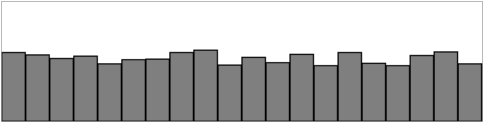

#### Exemplo I.2: Distribuição aleatória de números

```java
int[] randomCounts;		// Um array que registra qual a frequência que um número aleatório é sorteado.

void setup(){
    size(640, 240);
    randomCounts = new int[20];
}

void draw(){
    background(255);
    
    int index = int(random(randomCounts.length));		// Sorteia um número pseudo-randômico e incrementa o conta.
    randomCounts[index]++;
 
    stroke(0);
    fill(175);

    int w = width/randomCounts.length;

    for (int x = 0; x < randomCounts.length; x++){		// Desenhando os resultados.
    rect(x*w, height-randomCounts[x], w-1, randomCounts[x]);
 }
}
```

A captura de tela acima mostra o resultado do *sketch* sendo executado por alguns minutos. Observe como cada barra do gráfico difere em altura. Nosso tamanho de amostra (ou seja, o número de números aleatórios que escolhemos) é bastante pequeno e existem algumas discrepâncias ocasionais, em que determinados números são selecionados com mais frequência. Com o tempo, com um bom gerador de números aleatórios, isso seria o mesmo.

> **Números Pseudo-Randômicos**

> Os números randômicos que obtivemos utilizando a função `random()` não são realmente randômicos; portanto são chamados de "pseudoaleatórios". Eles são o resultado de funções matemáticas que simulam aleatoriedade. A função pode gerar um padrão ao longo do tempo, mas esse período é tão longo para nós que o padrão é imperceptível. Os números "pseudoaleatórios" funcionam tão bem quanto os randômicos nas aplicações de Processing.

#### Exercício I.1

Crie um caminhante aleatório que tenha a tendência de se mover para baixo e para a direita (veremos a solução para isso na próxima seção).

### I.3 Probabilidade e distribuições não uniformes

Lembra quando você começou a programar em Processing? Talvez você queira desenhar muitos círculos na tela. Então você pensou: "Ah, eu sei. Vou desenhar todos esses círculos em locais aleatórios, com tamanhos e cores aleatórias". Em um sistema de computação gráfica, muitas vezes é mais fácil produzir um sistema com aleatoriedade. Neste livro, no entanto, nós estamos a procura de construir sistemas modelados com base no que vemos na natureza. Um padrão de aleatoriedade não é uma solução particularmente cuidadosa para um problema de design – em particular, o tipo de problema que envolve a criação de uma simulação orgânica ou de aparência natural.

Com alguns truques, nós podemos modificar a maneira como usamos `random()` para produzir distribuições "não uniformes" de números aleatórios. Isso será útil ao longo do livro, quando examinarmos diversos cenários diferentes. Quando examinamos algoritmos genéticos, por exemplo, nós precisaremos de uma metodologia para realizar a "seleção": quais membros da nossa população devem ser selecionados para passar seu DNA para a próxima geração? Lembra do conceito de sobrevivência do mais apto? Digamos que temos uma população de macacos evoluindo. Nem todos os macacos terão chances iguais de reprodução. Para simular a evolução Darwiniana, não podemos simplesmente escolher dois macacos aleatórios para serem os pais. Precisamos que os mais "adequados" (*fit*) tenham maior probabilidade de serem escolhidos. Precisamos definir a "probabilidade do mais apto". Por exemplo, um macaco particularmente rápido e forte pode ter 90% de chance de procriar, enquanto um macaco mais fraco tem apenas 10% de chance.

Vamos fazer uma pausa aqui e dar uma olhada nos princípios básicos da probabilidade. Primeiro, examinaremos a probabilidade de um único evento, ou seja, a probabilidade de um determinado evento ocorrer.

Se você tem um sistema com um certo número de resultados possíveis, a probabilidade de ocorrência de um determinado evento é igual ao número de resultados que se qualificam como aquele evento dividido pelo número total de todos os resultados possíveis. O lançamento da moeda é um exemplo simples - tem apenas dois resultados possíveis: cara ou coroa. Só existe uma maneira de virar cara. A probabilidade de que a moeda dê cara, portanto, é dividida por dois: 1/2 ou 50%.

Pegue um baralho de cinquenta e duas cartas. A probabilidade de tirar um ás desse baralho é:

> número de ases / número de cartas = 4/52 = 0,077 = ~ 8%

A probabilidade de tirar um diamante é:

> número de diamantes / número de cartas = 13/52 = 0,25 = 25%

Também podemos calcular a probabilidade de vários eventos ocorrerem em sequência. Para fazer isso, simplesmente multiplicamos as probabilidades individuais de cada evento.

A probabilidade de uma moeda dar cara três vezes seguidas é:

> (1/2) * (1/2) * (1/2) = 1/8 (ou 0,125)

... o que significa que uma moeda vai dar cara três vezes seguidas em uma em cada oito vezes (cada "vez" sendo três lançamentos).

#### Exercício I.2

Qual é a probabilidade de tirar dois ases seguidos de um baralho de cinquenta e duas cartas?

Existem algumas maneiras pelas quais podemos usar a função `random()` com probabilidade no código. Uma técnica é preencher um *array* (N.T.: "arranjo") com uma seleção de números - alguns dos quais serão repetidos - e, em seguida, escolher números aleatórios do *array* e gerar eventos com base nessas escolhas.

```java
nt[] stuff = new int[5]

stuff[0] = 1;		// 1 será guardado no array duas vezes, aumentando a probabilidade de selecioná-lo.
stuff[1] = 1;

stuff[2] = 2;
stuff[3] = 3;
stuff[4] = 3;

int index = int(random(stuff.length));		// Selecionando um elemento do array
```

A execução desse código produzirá 40% de chance de imprimir o valor 1, 20% de chance de imprimir 2 e 40% de chance de imprimir 3.

Também podemos pedir um número aleatório (vamos simplificar e apenas considerar valores de ponto flutuante aleatório entre 0 e 1) e permitir que um evento ocorra apenas se nosso número aleatório estiver dentro de um determinado intervalo. Por exemplo:

```java
float prob = 0.10;		// Probabilidade de 10%.

float r = random(1);		// Um valor de ponto flutuante aleatório entre 0 e 1.

if (r < prob) {		// Se nosso número aleatório for menor que 0.1, tente novamente!
   // tente novamente!
}
```

Este método também pode ser aplicado para múltiplos resultados. Digamos que o Resultado A tenha 60% de chance de acontecer, o Resultado B, uma chance de 10% e o Resultado C, uma chance de 30%. Implementaremos isso no código, escolhendo um *float* aleatório e vendo em que intervalo ele irá cair.

- entre 0,00 e 0,60 (60%) –> Resultado A
- entre 0,60 and 0,70 (10%) –> Resultado B
- entre 0,70 e 1,00 (30%) –> Resultado C

```java
float num = random(1);

if (num < 0.6) {		// Se o número aleatório for menor que 0,6.
    println("Resultado A");

} else if (num < 0.7) {		// Entre 0,6 e 0,7.
    println("Resultado B");

} else {		// Maior que 0,7.
    println("Resultado C");
}

```

Poderíamos usar a metodologia acima para criar um *walker* ("caminhante") aleatório que tende a se mover para a direita. Aqui está um exemplo de um *walker* com as seguintes probabilidades:

- chance de subir: 20%
- chance de descer: 20%
- chance de mover para a esquerda: 20%
- chance de mover para a direita: 40%

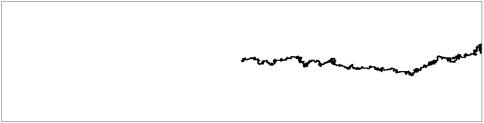

#### Exemplo I.3: O *walker* que tende se mover para a direita

```java
void step() {
 
    float r = random(1);

    if (r < 0.4) {		// Chance de 40% de se mover para a direita!
      x++;
    } else if (r < 0.6) {
      x--;
    } else if (r < 0.8) {
      y++;
    } else {
      y--;
    }
  }
```

#### Exercício I.3

Crie um *walker* aleatório com probabilidades dinâmicas. Por exemplo, você conseguiria dar a ele uma probabilidade de 50% de chance de se mover na direção do mouse?

### I.4 Uma Distribuição Normal de Números Aleatórios

Vamos voltar para aquela população de macacos simulada no Procesing. Seu programa gera mil objetos Monkey ("Macacos"), cada um com um valor de altura entre 200 e 300 (pois este é um mundo de macacos que possuem alturas entre 200 e 300 pixels).

```java
float h = random(200,300);
```

Isso representa com precisão as alturas dos organismos do mundo real? Pense em uma calçada lotada na cidade de Nova York. Escolha qualquer pessoa nessa rua e pode parecer que sua altura é aleatória. No entanto, não é o tipo de aleatório que `random()` produz. As alturas das pessoas não são distribuídas uniformemente; há muito mais pessoas de estatura média do que muito altas ou muito baixas. Para simular a natureza, gostaríamos de uma maior probabilidade de que nossos macacos tenham uma altura média (250 pixels), mas ainda permitir que eles sejam, ocasionalmente, muito baixos ou muito altos.

Uma distribuição de valores que se agrupam em torno de uma média (*mean*) é conhecida como distribuição "normal". É também chamada de distribuição Gaussiana (em homenagem ao matemático Carl Friedrich Gauss) ou, se você for francês, de distribuição Laplaciana (em homenagem a Pierre-Simon Laplace). Ambos os matemáticos trabalharam simultaneamente no início do século XIX na definição dessa distribuição.

Ao representar graficamente a distribuição, você obtém algo semelhante a seguinte imagem, informalmente conhecida como curva de sino:

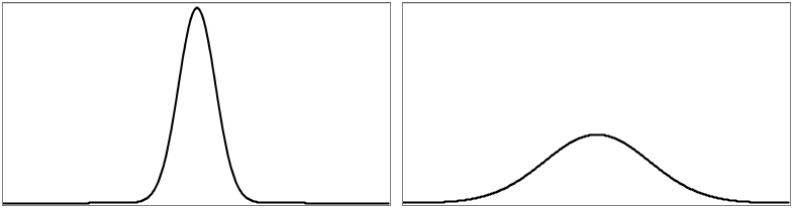

A curva é gerada por uma função matemática que define a probabilidade de qualquer valor ocorrer em função da média (muitas vezes escrita como &mu;, a letra grega mu) e do desvio padrão (&sigma;, a letra grega sigma).

A média é muito fácil de entender. No caso dos nossos valores da altura entre 200 e 300, você provavelmente tem uma noção intuitiva da média como 250. No entanto, e se eu dissesse que o desvio padrão é 3 ou 15? O que isso significa para os números? Os gráficos acima podem nos dar uma dica. O gráfico à esquerda nos mostra a distribuição com um desvio padrão muito baixo, onde a maioria dos valores se agrupa próximo à média. O gráfico à direita nos mostra um desvio padrão mais alto, em que os valores são mais uniformemente espalhados da média.

Os números funcionam da seguinte forma: dada uma população, 68% dos membros dessa população terão valores na faixa de um desvio padrão da média, 98% dentro de dois desvios padrão e 99,7% dentro de três desvios padrão. Dado um desvio padrão de 5 pixels, apenas 0,3% das alturas dos macacos será menor que 235 pixels (três desvios padrão abaixo da média de 250) ou maior que 265 pixels (três desvios padrão acima da média de 250).


> **Calculando a Média e o Desvio Padrão**
> 
> Considere uma sala de aula com dez alunos que recebem as seguintes pontuações (de 100) em um teste:
> 
> 85, 82, 88, 86, 85, 93, 98, 40, 73, 83
> 
> A média é: 81,3
> 
> O desvio padrão é calculado como a raiz quadrada da média dos quadrados dos desvios em torno da média. Em outras palavras, pegue a diferença da média para cada pessoa e eleve ao quadrado (variância). Calcule a média de todos esses valores e tome a raiz quadrada como o desvio padrão.
> 
> | **Pontuação** | **Diferença da média** | **Variância**        |
> |---------------|------------------------|----------------------|
> | 85    | 85-81,3 = 3,7   | (3,7)<sup>2</sup> = 13,69      |
> | 40     | 40-81,3 = -41,3 | (-41,3)<sup>2</sup> = 1705,69 |
> | etc.     |              |          |
> |     | **Variância média**    | 254,23               |

> **O desvio padrão é a raiz quadrada da variância média: 15,13**

Felizmente para nós, para utilizarmos uma distribuição normal de números aleatórios em um *sketch* no Processing, não precisamos fazer nenhum desses cálculos manualmente. Em vez disso, podemos fazer uso de uma classe conhecida como Random, que obtemos gratuitamente como parte das bibliotecas padrão em Java importadas para o Processing (para mais informações consulte os [JavaDocs](http://docs.oracle.com/javase/6/docs/api/java/util/Random.html)).

Para utilizar a classe Random, devemos primeiro declarar uma variável do tipo Random e criar o objeto Random em `setup()`.

```java
Random generator;		// Nós utilizamos o nome "generator" (gerador) porque o que temos aqui pode ser pensado como um gerador de números aleatórios.
 
void setup() {
  size(640,360);
  generator = new Random();
}

```

Se quisermos produzir um número aleatório com uma distribuição normal (ou Gaussiana) cada vez que executamos o `draw()`, é tão fácil quanto chamar a função `nextGaussian()`.


```java
void draw() {		// Pedindo para um número aleatório Gaussiano (note que nextGaussian() retorna um "double" e deve ser convertido em um "float").
  float num = (float) generator.nextGaussian();
}
```

Aqui está um detalhe. O que devemos fazer com esse valor? E se quiséssemos usá-lo, por exemplo, para atribuir a posição x de um desenho na tela?

A função `nextGaussian()` retorna uma distribuição normal de números aleatórios com os seguintes parâmetros: uma média de zero e um desvio padrão de um. Digamos que queremos uma média de 320 (o pixel horizontal central em uma janela de 640 largura) e um desvio padrão de 60 pixels. Podemos ajustar o valor aos nossos parâmetros multiplicando-o pelo desvio padrão e adicionando a média.

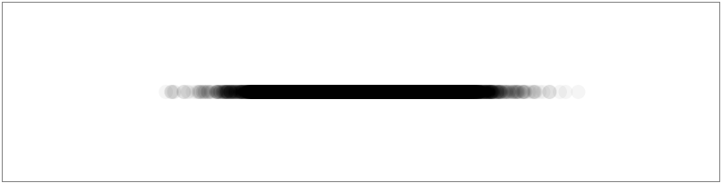

#### Exemplo I.4: Distribuição Gaussiana

```java
void draw() {		// Observe que o nextGaussian() retorna um "double".

  float num = (float) generator.nextGaussian();
  float sd = 60;
  float mean = 320;
 
  float x = sd * num + mean;		// Multiplique pelo desvio padrão da média e adicione-o na média.
 
  noStroke();
  fill(255,10);
  ellipse(x,180,16,16);
}
```

Desenhando as elipses umas sobre as outras com um pouco de transparência, podemos observar a distribuição claramente. O ponto mais brilhante fica próximo ao centro, onde a maioria dos valores se agrupam, mas de vez em quando os círculos são desenhados mais à direita ou à esquerda do centro.

#### Exercício I.4

Considere uma simulação de respingos de tinta desenhada como uma coleção de pontos coloridos. A maior parte da tinta se aglomera em torno de um local central, mas alguns pontos se espalham em direção às bordas. Você conseguiria utilizar a distribuição normal de números aleatórios para gerar as localizações destes pontos? Você também conseguiria utilizar a distribuição normal de números aleatórios para gerar uma paleta de cores?

#### Exercício I.5

Um caminhante aleatório gaussiano (*Gaussian random walker*) é definido como aquele em que o tamanho do passo (a distância que o objeto se move em uma determinada direção) é gerado por uma distribuição normal. Implemente esta variação no nosso caminhante aleatório.

### I.5 Uma Distribuição de Números Aleatórios Personalizados

Chegará um momento em sua vida em que você não desejará uma distribuição uniforme de valores aleatórios, ou mesmo Gaussiana. Vamos imaginar por um momento que você é um caminhante aleatório (*random walker*) em busca de comida. Movimentar-se aleatoriamente em um espaço parece uma estratégia razoável para se buscar alguma coisa para comer. Afinal, você não sabe onde está a comida, então é melhor procurar aleatoriamente até encontrá-la. O problema, como você deve ter notado, é que os caminhantes aleatórios retornam muitas vezes aos locais visitados anteriormente (isso é conhecido como "sobreamostragem"). Uma estratégia para evitar esse problema é, de vez em quando, dar um passo muito grande. Isso permite que o caminhante vasculhe aleatoriamente um local específico enquanto pula periodicamente para muito longe para reduzir a quantidade de sobreamostragem. Esta variação na caminhada aleatória (conhecido como vôo de Lévy) requer um conjunto personalizado de probabilidades. Embora não seja uma implementação exata de um voo de Lévy, poderíamos estabelecer a distribuição de probabilidade da seguinte maneira: quanto mais longo o passo, menor a probabilidade de ser selecionado; quanto mais curto o passo, maior a probabilidade.

Anteriormente, nós vimos que poderíamos gerar distribuições de probabilidade customizadas preenchendo um *array* com valores (alguns valores duplicados para que fossem selecionados com mais frequência) ou testando o resultado de `random()`. Poderíamos implementar um voo de Lévy dizendo que há 1% de chance do caminhante dar um grande passo.


```java
float r = random(1);

if (r < 0.01) {		// 1% de chance de dar um passo largo.
    xstep = random(-100,100);
    ystep = random(-100,100);

} else {
    xstep = random(-1,1);
    ystep = random(-1,1);
}
```

Entretanto, isto reduz as probabilidades a um número fixo de opções. E se quiséssemos fazer uma regra mais geral: quanto mais alto um número, maior a probabilidade de ele ser escolhido; 3,145 seria mais provável de ser escolhido do que 3,144, mesmo que essa probabilidade seja apenas um pouquinho maior. Em outras palavras, se x for o número aleatório, poderíamos mapear a probabilidade no eixo y com y = x.

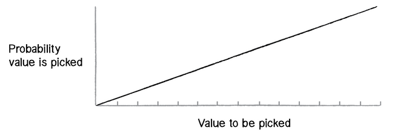

Se agente puder descobrir como gerar uma distribuição de números aleatórios de acordo com o gráfico acima, seremos capazes de aplicar a mesma metodologia a qualquer curva para a qual temos uma fórmula.

Uma solução é escolher dois números aleatórios em vez de um. O primeiro número aleatório é apenas isso, um número aleatório. O segundo, no entanto, é o que chamaremos de "valor aleatório qualificado". Ele nos dirá se devemos usar o primeiro ou descartá-lo e escolher outro. Números mais qualificados serão escolhidos com mais frequência, e os números que raramente se qualificam serão escolhidos com menos frequência. Aqui estão as etapas (por agora, vamos considerar apenas valores aleatórios entre 0 e 1):

- Selecione um número aleatório: R1
- Calcule a probabilidade P de que R1 seja qualificado. Vamos tentar: P = R1
- Selecione um outro número alatório: R2
- Se R2 for menor que P, então encontramos nosso número--R1!
- Se R2 não for menor que P, volte para a etapa 1 e recomece.

Assim dizemos que a probabilidade de que um número aleatório seja qualificado é igual ao próprio número aleatório. Digamos que escolhemos 0,1 para R1. Isso significa que R1 terá 10% de chance de se qualificar. Se escolhermos 0,83 para R1, ele terá 83% de chance de se classificar. Quanto maior o número, maior a probabilidade utilizá-lo.

Aqui está uma função (nomeada para o método Monte Carlo, que foi nomeada para o casino Monte Carlo) que implementa o algoritmo acima, retornando um valor aleatório entre 0 e 1.


```java
float montecarlo() {		// Vamos fazer isso "para sempre" té encontrar um número aleatório qualificado.

    while (true) {

    float r1 = random(1);		// Selecione um valor aleatório.

    float probability = r1;		// Atribua a probabilidade.

    float r2 = random(1);		// Selecione um segundo número aleatório.

    if (r2 < probability) {		// Ele está qualificado? caso positivo, pronto!
      return r1;
    }

  }
}
```

#### Exercício I.6

Utilize uma distribuição de probabilidade personalizada para variar o tamanho de um passo dado pelo caminhante aleatório. O tamanho do passo pode ser determinado se você influenciar na faixa de valores escolhidos. Você conseguiria mapear a probabilidade exponencialmente? Ou seja, tornaria a probabilidade de que um valor seja escolhido igual ao valor ao quadrado.

```java
  float stepsize = random(0,10);		// Uma distribuição uniforme de tamanho dos passos; modifique isso!
 
  float stepx = random(-stepsize,stepsize);
  float stepy = random(-stepsize,stepsize);
 
  x += stepx;
  y += stepy;
```

(Mais tarde nós veremos como fazer isso de uma forma mais eficiente utilizando vetores.)

### Ruído Perlin (Uma Abordagem Suave)

Um bom gerador de números aleatórios produz números que não se relacionam e também não mostram nenhum tipo de padrão discernível. Como estamos começando a ver, um pouco de aleatoriedade pode ser uma coisa boa ao se programar comportamentos orgânicos e naturais. No entanto, eventos aleatórios como o único princípio orientador não é necessariamente natural. Um algoritmo conhecido como "ruído de Perlin" (*Perlin noise*), batizado em homenagem a seu inventor, Ken Perlin, leva esse conceito em consideração. Perlin desenvolveu a função de ruído enquanto trabalhava no filme *Tron* original no início dos anos 1980; ele foi projetado para criar texturas procedurais para efeitos gerados por computador. Em 1997, Perlin ganhou um Oscar técnico por seu trabalho. O ruído Perlin pode ser usado para gerar vários efeitos com características naturais, como nuvens, paisagens e texturas padronizadas como o mármore.

O ruído de Perlin tem uma aparência mais orgânica porque produz uma sequência naturalmente ordenada ("suave") de números pseudoaleatórios. O gráfico à esquerda abaixo mostra o ruído Perlin ao longo do tempo, com o eixo x representando o tempo; observe a suavidade da curva. O gráfico à direita mostra números puramente aleatórios ao longo do tempo (o código para gerar esses gráficos está disponível nos downloads do livro que o acompanha).

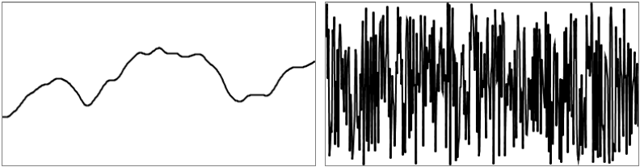

O Processing já possui uma implementação interna do algoritmo de ruído Perlin: a função `noise()`. A função `noise()` leva um, dois ou três argumentos, já que o ruído é calculado em uma, duas ou três dimensões. Vamos começar observando o ruído unidimensional.

> **Detalhe de ruído**
> 
> A [referência de ruído](http://processing.org/reference/noise_.html) no Processing nos diz que o ruído é calculado em várias "oitavas". Chamar a função [noiseDetail()](http://processing.org/reference/noiseDetail_.html) mudará o número de oitavas e também sua importância relativa ao outro. Isso, por sua vez, muda como a função de ruído se comporta.
> 
> Uma palestra online de Ken Perlin permite que você aprenda mais sobre como o ruído funciona com o próprio [autor](http://www.noisemachine.com/talk1/).

Considere desenhar um círculo na janela do Processing em uma localização x aleatória.

```java
float x = random(0,width);		// Uma localização aleatória x.
ellipse(x,180,16,16);
```

Agora, em vez de uma localização x aleatória, queremos uma localização x de ruído Perlin que seja "mais suave". Tudo o que você precisa fazer é substituir `random()` por `noise()`, ou seja:

```java
float x = noise(0,width);	// Um ruído na localização x?
```

Embora, conceitualmente, isso seja exatamente o que queremos fazer -- calcular um valor x que varia entre 0 e a largura de acordo com o ruído de Perlin -- essa não é a implementação correta. Enquanto os argumentos para a função `random()` especificam uma faixa de valores entre um mínimo e um máximo, `noise()` não funciona dessa maneira. Em vez disso, o intervalo de saída é fixo: ele sempre retorna um valor entre 0 e 1. Veremos em breve que podemos contornar isso facilmente com a função `map()` do Processing, mas primeiro devemos examinar o que exatamente a função `noise()` espera como argumento.

Podemos pensar no ruído Perlin unidimensional como uma sequência linear de valores ao longo do tempo. Por exemplo:

| **Tempo** | **Valor de ruído** |
|-------|----------------|
| 0     | 0,365          |
| 1     | 0,363          |
| 2     | 0,363          |
| 3     | 0,364          |
| 4     | 0,366          |

Agora, para acessarmos um determinado valor de ruído no Processing, temos que passar um "momento no tempo" específico para a função `noise()`. Por exemplo:

```java
float n = noise(3);
```

De acordo com a tabela acima, o `noise(3)` retornará 0,364 no tempo igual a 3. Podemos melhorar isso utilizando uma variável para o tempo e solicitando um valor de ruído contínuo em `draw()`.

```java
float t = 3;
 
void draw() {		// Nós precisamos do valor de ruído para um momento específico no tempo.

  float n = noise(t);
  println(n);
}
```

O código acima resulta no mesmo valor impresso várias e várias vezes. Isso acontece porque estamos solicitando o resultado da função `noise()` no mesmo ponto no tempo - 3 - continuamente. Entretanto, se incrementarmos a variável de tempo `t`, obteremos um resultado diferente.

```java
float t = 0;		// Normalmente começamos no tempo = 0, mas é completamente arbitrário.
 
void draw() {
  float n = noise(t);
  println(n);

  t += 0.01;		// Agora nos movemos no tempo!
}
```

A velocidade com que incrementamos `t` também afeta a suavidade do ruído. Se dermos grandes saltos no tempo, estaremos avançando e os valores serão mais aleatórios.

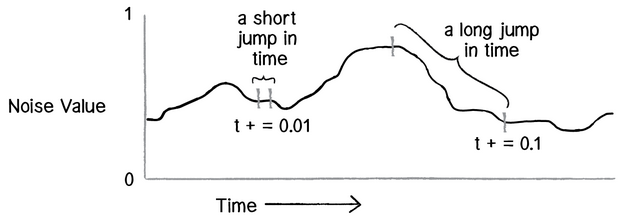

Tente executar o código várias vezes, incrementando `t` em 0,01, 0,02, 0,05, 0,1, 0,0001 e você verá resultados diferentes.

#### Mapeando o ruído

Agora estamos prontos para responder à pergunta sobre o que fazer com o valor do ruído. Uma vez que temos o valor com um intervalo entre 0 e 1, agora podemos mapear esse intervalo para o que queremos. A maneira mais fácil de fazer isso é com a função `map()` do Processing. A função `map()` leva cinco argumentos. O primeiro é o valor que queremos mapear, neste caso `n`. Em seguida, temos que fornecer a faixa atual do valor (mínimo e máximo), seguido por nossa faixa desejada.

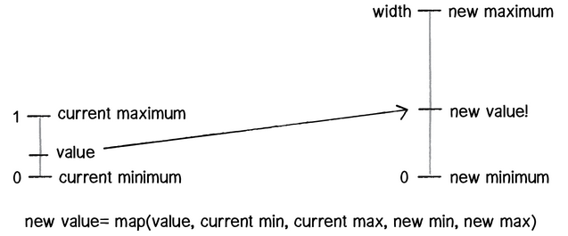

Neste caso, sabemos que o ruído tem um intervalo entre 0 e 1, mas gostaríamos de desenhar nosso círculo com um intervalo entre 0 e a largura da janela.

```java
float t = 0;
 
void draw() {
  float n = noise(t);  

  float x = map(n,0,1,0,width);		// Utilize map() para customizar o alcance do ruído de Perlin.
  ellipse(x,180,16,16);
 
  t += 0.01;
}
```
Agora podemos aplicar exatamente a mesma lógica ao nosso caminhante aleatório e atribuir seus valores de x e y de acordo com o ruído de Perlin.

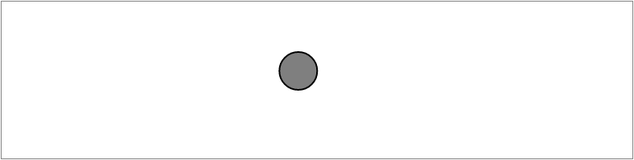

#### Exemplo I.5: Ruído de Perlin Caminhante (*Perlin noise walker*)


```java
class Walker {
	float x,
	float tx,ty;
 
Walker() {
	tx = 0;
	ty = 10000;
}
 
void step() {
	x = map(noise(tx), 0, 1, 0, width);		// Localizações x e y mapeadas do ruído.
    y = map(noise(ty), 0, 1, 0, height);

    tx += 0.01;		// Se mova através do "tempo".
    ty += 0.01;

  }
}
```

Observe como o exemplo acima requer duas variáveis adicionais: tx e ty. Isso é necessário porque precisamos controlar duas variáveis de tempo, uma para a localização x do objeto Walker e outra para a localização y. Mas há algo um pouco estranho nessas variáveis. Por que tx começa em 0 e ty em 10.000? Embora esses números sejam escolhidos arbitrariamente, nós fomos muito claros nas escolhas de tempo para as duas variáveis. Isso ocorre porque a função de ruído é determinística: ela fornece o mesmo resultado para um tempo específico `t` todas as vezes. Se pedíssemos o valor do ruído no mesmo tempo `t` para x e y, então x e y seriam sempre iguais, o que significa que o objeto Walker só se moveria ao longo de uma diagonal. Em vez disso, simplesmente usamos duas partes diferentes do espaço de ruído, começando em 0 para x, e 10.000 para y, de modo que x e y possam parecer agir independentemente um do outro.

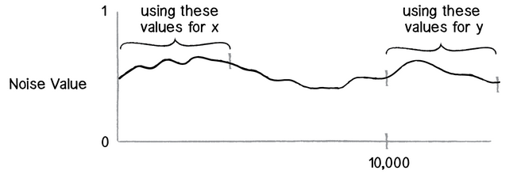

Na verdade, não existe um conceito real de tempo aqui. É uma metáfora útil para nos ajudar a entender como funciona a função de ruído, mas na verdade o que temos é espaço, em vez de tempo. O gráfico acima representa uma sequência linear de valores de ruído em um espaço unidimensional, e podemos pedir um valor em uma localização x específica sempre que quisermos. Nos exemplos, você frequentemente verá uma variável chamada `x-offset` para indicar o deslocamento x ao longo do gráfico de ruído, em vez de `t` para o tempo (conforme observado no diagrama).

#### Exercício I.7
No caminhante aleatório acima, o resultado da função de ruído é mapeado diretamente na localização do caminhante. Crie um andador aleatório onde você mapeie o resultado da função `noise()` para o tamanho do passo de um Walker.

#### Ruído Bidimensional
A ideia dos valores de ruído em um espaço unidimensional é importante porque nos leva diretamente a uma discussão sobre o espaço bidimensional. Vamos pensar sobre isso por um momento. Com o ruído unidimensional, temos uma sequência de valores em que qualquer valor dado é semelhante ao seu vizinho. Como o valor está em uma dimensão, ele tem apenas dois vizinhos: um valor que vem antes dele (à esquerda no gráfico) e outro que vem depois dele (à direita).


O ruído bidimensional funciona exatamente da mesma maneira conceitualmente. A diferença, claro, é que não estamos olhando para valores ao longo de um caminho linear, mas valores que estão em uma grade. Pense em uma folha de papel quadriculada com números escritos em cada um dos quadrantes. Um determinado valor será semelhante a todos os seus vizinhos: acima, abaixo, à direita, à esquerda e ao longo de qualquer diagonal.

Se você olhar este papel com cada valor mapeado para o brilho de uma cor, você obteria algo que se parece com nuvens. O branco fica ao lado do cinza claro, que fica ao lado do cinza, que fica ao lado do cinza escuro, que fica ao lado do preto, que fica ao lado do cinza escuro, etc.

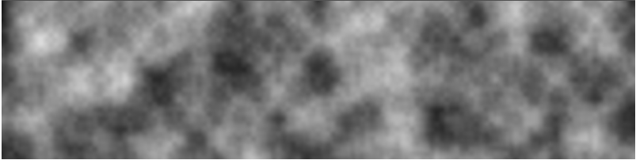

É por isso que o ruído foi originalmente inventado. Você ajusta um pouco os parâmetros ou brinca com as cores para fazer a imagem resultante parecer mais com mármore ou madeira ou qualquer outra textura orgânica.

Vamos dar uma olhada rápida em como implementar ruído bidimensional no Processing. Se você quisesse colorir cada pixel de uma janela aleatoriamente, precisaria de um *nested loop*, um que acessasse cada pixel e escolhesse um brilho aleatório.

```java
loadPixels();
for (int x = 0; x < width; x++) {
	for (int y = 0; y < height; y++) {
		float bright = random(255);		// Um brilho aleatório.
		pixels[x+y*width] = color(bright);
  }
}
updatePixels();
```

Para colorir cada pixel de acordo com a função `noise()`, faremos exatamente a mesma coisa, mas em vez de chamar `random()`, chamaremos `noise()`.

```java
float bright = map(noise(x,y),0,1,0,255);		// Brilho do ruído de Perlin!
```

Este é um bom começo conceitualmente - ele fornece um valor de ruído para cada localização (x, y) em nosso espaço bidimensional. O problema é que não terá a qualidade turva ou nublada que desejamos. Saltar do pixel 200 para o pixel 201 é um salto muito grande no ruído. Lembre-se, quando trabalhamos com ruído unidimensional, incrementamos nossa variável de tempo em 0,01 a cada quadro, não em 1! Uma boa solução para esse problema é utilizar variáveis diferentes para os argumentos do ruído. Por exemplo, poderíamos incrementar uma variável chamada `xoff` cada vez que nos movermos horizontalmente e uma variável `yoff` cada vez que movermos verticalmente pelos *loops* aninhados.

#### Exemplo I.6: Ruído de Perlin 2D

```java
float xoff = 0.0;		// Começando xoff em 0.

for (int x = 0; x < width; x++) {
	float yoff = 0.0; // Para cada xoff, começe yoff em 0.
	
for (int y = 0; y < height; y++) {
    float bright = map(noise(xoff,yoff),0,1,0,255);		// Utilize xoff e yoff para o noise().

    pixels[x+y*width] = color(bright);		// Utilize x e y para a localização do pixel.

    yoff += 0.01;		// Incremente yoff.
  }
	xoff += 0.01;		// Incremente xoff.
}
```

#### Exercício I.8
Brinque com a cor, `noiseDetail()` e a taxa na qual xoff e yoff são incrementados para obter diferentes efeitos visuais.

#### Exercício I.9
Adicione um terceiro argumento ao ruído que aumenta uma vez por ciclo utilizando o `draw()` para animar o ruído bidimensional.

#### Exercício I.10
Utilize os valores de ruído como as elevações de uma paisagem. Veja a imagem abaixo como referência.

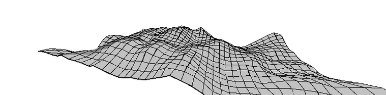

Nós examinamos vários usos tradicionais do ruído Perlin nesta seção. Com o ruído unidimensional, usamos valores suaves para atribuir a localização de um objeto e dar a aparência de algo errante. Com ruído bidimensional, criamos um padrão nebuloso com valores suavizados em um plano de pixels. É importante lembrar, no entanto, que os valores de ruído de Perlin são apenas isso - valores. Eles não são inerentemente vinculados à localização ou a cor dos pixels. Qualquer exemplo neste livro que tenha uma variável pode ser controlado por meio do ruído Perlin. Quando modelamos a força do vento, sua força pode ser controlada pelo ruído de Perlin. O mesmo vale para os ângulos entre os galhos em um padrão de árvore fractal, ou a velocidade e direção dos objetos que se movem ao longo de uma grade em uma simulação de campo de fluxo.

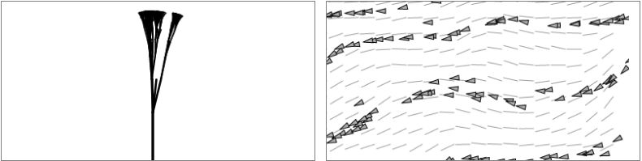

### I.7 Avante

Começamos este capítulo falando sobre como a aleatoriedade pode ser uma muleta. De muitas maneiras, é a resposta mais óbvia para os tipos de perguntas que fazemos continuamente - como esse objeto deve se mover? Qual deve ser a cor? Essa resposta óbvia, entretanto, também pode ser preguiçosa.

Ao terminarmos essa introdução, também é importante notar que poderíamos facilmente cair na armadilha de usar o ruído de Perlin como uma muleta. Como esse objeto deve se mover? Ruído de Perlin! Qual deve ser a cor? Ruído de Perlin! Quão rápido deve crescer? Ruído de Perlin!

O objetivo de tudo isso não foi dizer que você deve ou não deve usar a aleatoriedade. Ou que você deve ou não deve usar o ruído Perlin. A questão é que as regras do seu sistema são definidas por você, e quanto maior for a sua caixa de ferramentas, mais opções você terá ao implementar essas regras. O objetivo deste livro é preencher sua caixa de ferramentas. Se tudo o que você sabe é aleatório, seu pensamento de design é limitado. Claro, o ruído Perlin ajuda, mas você precisará de mais. Muito mais.

Acho que estamos prontos para começar.